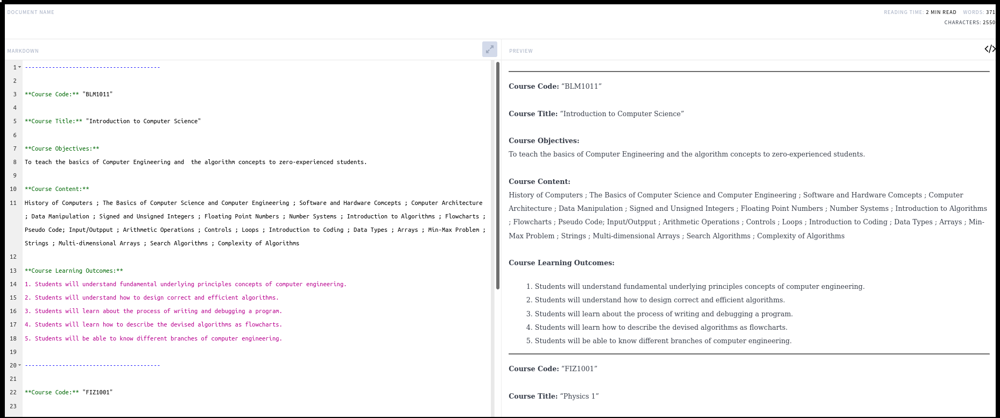

# YTU (Yıldız Technical University) Bologna English Curriculum Scraper

You can scrape English course descriptions from [YTU Bologna page](http://www.bologna.yildiz.edu.tr) via this small program! Then, you can use it in your master's or PhD applications.


## Example Output

+ If you want to see a complete curriculum example, please take a look at these files: [example_output.pdf](./docs/example_output.pdf), [example_output.html](./docs/example_output.html).

+ This program writes the output to a markdown file ``output.md`` file by default. A Markdown file is in fact a plain text, but its syntax is compatible with HTML, as in this ``README.md`` file. You can see an example plain text output below:

```
----------------------------------------

**Course Code:** "BLM1011"

**Course Title:** "Introduction to Computer Science"

**Course Objectives:**
To teach the basics of Computer Engineering and  the algorithm concepts to zero-experienced students.

**Course Content:**
History of Computers ; The Basics of Computer Science and Computer Engineering ; Software and Hardware Comcepts ; Computer Architecture ; Data Manipulation ; Signed and Unsigned Integers ; Floating Point Numbers ; Number Systems ; Introduction to Algorithms ; Flowcharts ; Pseudo Code; Input/Outpput ; Arithmetic Operations ; Controls ; Loops ; Introduction to Coding ; Data Types ; Arrays ; Min-Max Problem ; Strings ; Multi-dimensional Arrays ; Search Algorithms ; Complexity of Algorithms

**Course Learning Outcomes:**
1. Students will understand fundamental underlying principles concepts of computer engineering.
2. Students will understand how to design correct and efficient algorithms.
3. Students will learn about the process of writing and debugging a program.

----------------------------------------

**Course Code:** "FIZ1001"

**Course Title:** "Physics 1"

**Course Objectives:**
To introduce the fundamental principles and concepts of physics in detail at freshmen level. To build a strong background for physics major as well as showing the necessity and importance of physics for other branches of natural sciences and engineering through applications in real life, and industry and technology.

**Course Content:**
Physics and Measurement, Vectors, Motion in One Dimension, Motion in Two Dimensions, The Laws of Motion, Circular Motion and other Applications of Newton’s Laws, Work and Kinetic Energy, Potential Energy and Conservation of Energy, Linear Momentum and Collisions, Rotation of a Rigid Object About a Fixed Axis, Rotation of a Rigid Object About a Moving Axis, Torque and Angular Momentum, Statik Equilibrium and Elasticity, Oscillatory Motion.

**Course Learning Outcomes:**
1. Students would have up to date information, software, theoretical and practical knowledge on Physics. Moreover, they will be equipped with knowledge sufficiently to use Physics related resources.
2. Students would acquire theoretical knowledge on subject of Physics theories.
3. They could apply the theoretical knowledge gained in the field of Physics

----------------------------------------
```

+ You can easily convert this output to HTML or even pdf. For this purpose, you can use [dillinger.io](dillinger.io) as shown below:



## How to Build

+ If you are using a GNU/Linux operating system, you can directly build by executing the following Bash command:

```bash
chmod u+x ./build.sh && ./build.sh
```

+ If you are not using a GNU/Linux operating system, please manually install dependencies in ``requirements.txt`` and make sure that your python and pip packages are up-to-date. 


## How to Run

+ First, fill ``./data/course_codes_to_links.json`` file with a code and a link for each course. An example can be seen below:

```json
{
  "course_codes_to_links":{
    "BLM1011":"http://www.bologna.yildiz.edu.tr/index.php?r=course/view&id=9450&aid=3",
    "BLM3130":"http://www.bologna.yildiz.edu.tr/index.php?r=course/view&id=9466&aid=3",
    "BLM3520":"http://www.bologna.yildiz.edu.tr/index.php?r=course/view&id=9467&aid=3",
    "BLM3590":"http://www.bologna.yildiz.edu.tr/index.php?r=course/view&id=7321&aid=3",
    "BLM3750":"http://www.bologna.yildiz.edu.tr/index.php?r=course/view&id=5901&aid=3",
    "BLM4021":"http://www.bologna.yildiz.edu.tr/index.php?r=course/view&id=9463&aid=3",
    "EHM4991":"http://www.bologna.yildiz.edu.tr/index.php?r=course/view&id=9698&aid=3",
    "TDB1031":"http://www.bologna.yildiz.edu.tr/index.php?r=course/view&id=200&aid=3",
    "BLM4002":"http://www.bologna.yildiz.edu.tr/index.php?r=course/view&id=7873&aid=3",
    "BLM9000":"http://www.bologna.yildiz.edu.tr/index.php?r=course/view&id=6295&aid=3",
  }
}
```

+ If you are using a GNU/Linux operating system, you can directly run by executing the following Bash command:

```bash
chmod u+x ./run.sh && ./run.sh
```

+ If you are not using a GNU/Linux operating system, please manually execute ``python3 main.py``.
